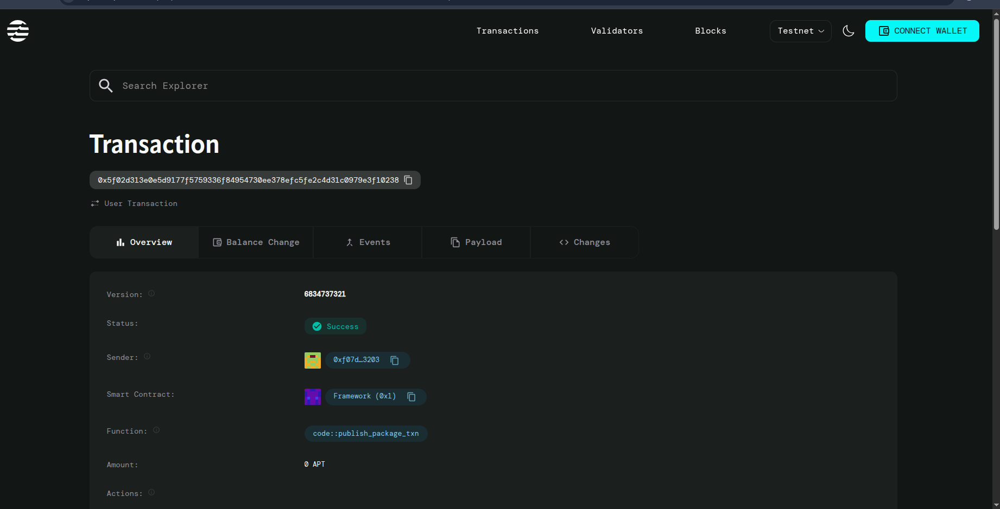

# NFT Collection Manager

## Project Title
**NFT Collection Manager**

## Project Description
The NFT Collection Manager is a smart contract built on the Aptos blockchain that enables users to create and manage hierarchical NFT collections. The contract provides a structured approach to organizing digital assets through collections that contain multiple series, with each series capable of holding multiple editions. This system is ideal for artists, creators, and businesses who want to launch organized NFT drops with clear categorization and supply management.

## Project Vision
Our vision is to simplify the creation and management of complex NFT collections on the Aptos blockchain. We aim to provide creators with an intuitive, gas-efficient solution that allows for sophisticated collection structures while maintaining ease of use. The platform will serve as a foundation for diverse NFT projects, from art collections and trading cards to gaming assets and digital collectibles, enabling creators to focus on their content while we handle the technical infrastructure.

## Key Features

### 🎨 **Hierarchical Structure**
- Create main collections that serve as umbrella containers
- Add multiple series within each collection for better organization
- Each series can have configurable edition limits

### 📊 **Collection Management**
- Simple collection creation with customizable names
- Automatic tracking of total series and editions
- Built-in counters for statistical analysis

### 🔢 **Series Control**
- Add new series to existing collections
- Set maximum edition limits per series
- Unique series identification system

### ⚡ **Optimized Performance**
- Lightweight contract design (under 50 lines)
- Efficient data structures using Aptos Move
- Gas-optimized operations

### 🔒 **Ownership Security**
- Creator-controlled collection management
- Secure ownership verification
- Protected series addition functionality

## Future Scope

### Phase 1 - Enhanced Functionality
- **Edition Minting**: Add capability to mint individual NFT editions within series
- **Metadata Integration**: Support for rich metadata and IPFS URI storage
- **Transfer Functions**: Enable collection and series ownership transfers

### Phase 2 - Advanced Features
- **Royalty Management**: Implement creator royalties and revenue sharing
- **Marketplace Integration**: Built-in marketplace functionality for trading
- **Batch Operations**: Support for bulk series creation and management

### Phase 3 - Enterprise Features
- **Multi-Creator Support**: Allow collaborative collection management
- **Advanced Analytics**: Detailed statistics and performance metrics
- **Cross-Chain Compatibility**: Explore integration with other blockchains

### Phase 4 - Community Features
- **Governance Token**: Community voting on collection features
- **Creator Rewards**: Incentive programs for active creators
- **API Development**: RESTful APIs for third-party integrations

## Contract Details
0x5f02d313e0e5d9177f5759336f84954730ee378efc5fe2c4d31c0979e3f10238
